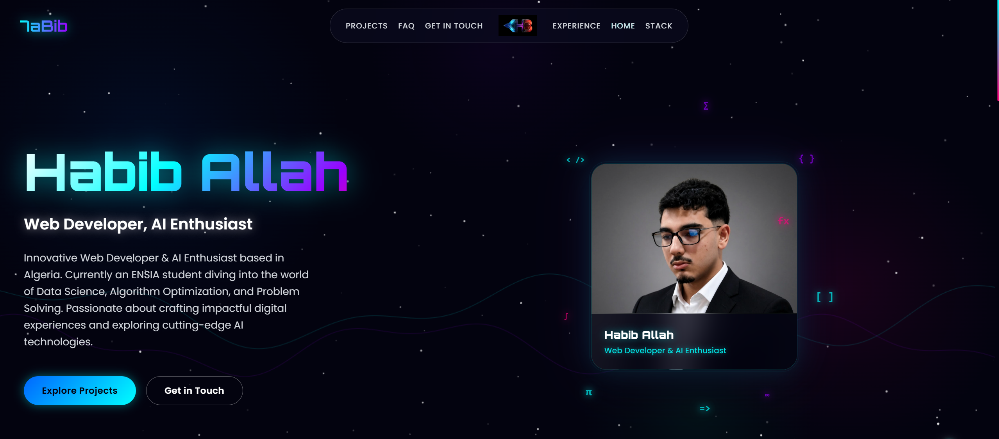

# 🚀 Habib Allah | Web Developer Portfolio

Welcome to the source code of my personal portfolio! This project is a highly optimized, cyberpunk-themed interactive web experience built to showcase my skills in web development, software engineering, and AI.

## 🌌 The Interface
 
🟢 Live Demo: [Click here to view my portfolio](https://portfolio-hoow.vercel.app/)


## 🛠️ Tech Stack & Features
* **Framework:** React.js / Vite
* **Styling:** Tailwind CSS, Custom CSS, Glassmorphism UI, Neon Aesthetics
* **Animations:** High-performance custom cursor trails and particle physics
* **Responsiveness:** Fully mobile-optimized layouts

## 🚀 Running the Project Locally

If you want to explore the code on your own machine:

1. Clone the repository:
   ```bash
   git clone [https://github.com/habib-allahboukhtache-1/portfolio.git](https://github.com/habib-allahboukhtache-1/portfolio.git)

2. Navigate the directory:
    Bash
    cd portfolio

3. Install dependencies:
    Bash
    npm install

4.  run the project
    bash 
    npm run dev

📫 Let's Connect
[LinkedIn](https://www.google.com/search?q=https://www.linkedin.com/in/habib-allah-boukhtache-177278383)

[GitHub](https://github.com/habib-allahboukhtache-1)

Email: [EMAIL_ADDRESS]

---

### 3. Pushing to GitHub (Step-by-Step)

Now that your project is ready and your README is set, let's push the code. Open the terminal inside your VS Code and run these commands exactly as written:

**Step A: Initialize Git & Track Files**
```bash
git init
git add .
git commit -m "Initial commit: Cyberpunk portfolio launch with custom animations and glassmorphism UI"